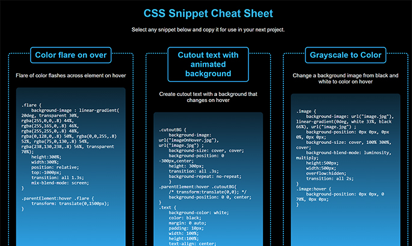

# CSS-Cheat-Sheet
A list of CSS tips and tricks inspired by the UT Full Stack Development Bootcamp

## A simple project to keep fun code snippets for use in later projects

___

This project started as a simple introduction to CSS and flexbox in the UT-Austin Full-Stack Development Bootcamp. As i went through the project I thought it would end up being a nice file to keep updating as I learn more tips and tricks. So I've added a few more snippets over time and I plan to keep adding more as I find more interesting features available.

If you want to take a look and try out some snippets on your own, [you can see it live here.](https://markgatx.github.io/CSS-Cheat-Sheet/)

___

## How to use

Using the app is very simple. When you open the page you'll see a long list of snippets. In each code block you'll get a brief overview of what each snippet does and the necessary code underneath.

If you want to use the code, simply click anywhere in the code block and all of the text will highlight. 

Right-click with your mouse and choose "copy" or use `CTRL/CMD C` on the keyboard. 

Then you can paste that code in your own project by either right clicking and selecting "paste" or pressing `CTRL/CMD V` on your keyboard.

Simple as that. 

Keep in mind you'll need to change the values based on your project. For example, you might see something in the code that says "parentElement." You'll need to replace that text with what the actual parent element in your project is. Once you do that, things should work like a charm.

Play around with the values and see what effects you can get and have fun. Let me know if you come across any other snippets I should add to the list and let me know who I should credit for them as well.

___

## Changes Made and Lessons Learned

- I modified the original code to make the neon effect a little more "realistic" by using multiple borders. Neon lights very often are almost white in the middle so you can see the very center border is white and the colors fade out from there. I like the effect overall, even though it may be a little "Viva Las Vegas" for regular use. It was a fun challenge to improve the neon effect, though.

___

## Possible Future Changes

- If the page gets too big then I'll need to add some pagination capabilities

___

## Credits

The original visual concept was created by staff of the UT Austin Full Stack Development Bootcamp. Thanks to Leah, Ian, Negin, Diem, and all the students who work with me daily to keep improving. 

___

## License

MIT License

Copyright (c) 2022 Mark Gardner

Permission is hereby granted, free of charge, to any person obtaining a copy
of this software and associated documentation files (the "Software"), to deal
in the Software without restriction, including without limitation the rights
to use, copy, modify, merge, publish, distribute, sublicense, and/or sell
copies of the Software, and to permit persons to whom the Software is
furnished to do so, subject to the following conditions:

The above copyright notice and this permission notice shall be included in all
copies or substantial portions of the Software.

THE SOFTWARE IS PROVIDED "AS IS", WITHOUT WARRANTY OF ANY KIND, EXPRESS OR
IMPLIED, INCLUDING BUT NOT LIMITED TO THE WARRANTIES OF MERCHANTABILITY,
FITNESS FOR A PARTICULAR PURPOSE AND NONINFRINGEMENT. IN NO EVENT SHALL THE
AUTHORS OR COPYRIGHT HOLDERS BE LIABLE FOR ANY CLAIM, DAMAGES OR OTHER
LIABILITY, WHETHER IN AN ACTION OF CONTRACT, TORT OR OTHERWISE, ARISING FROM,
OUT OF OR IN CONNECTION WITH THE SOFTWARE OR THE USE OR OTHER DEALINGS IN THE
SOFTWARE.
